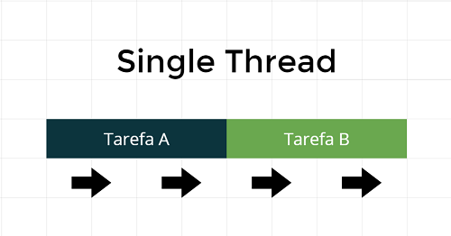
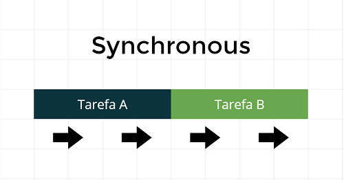
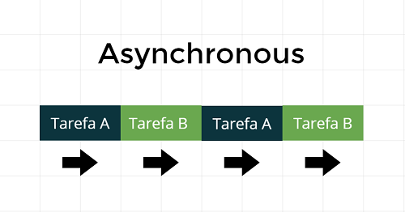
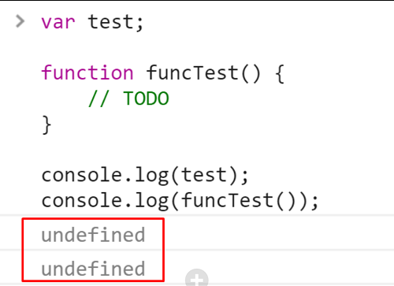
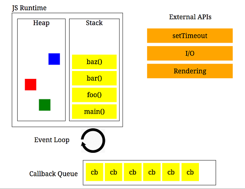

# Review of the basics of Javascript

> Group 5 · Corrected version of the former `JAVASCRIPT.md` · Priority MEDIUM (fundamentals that get probed in a spoken interview)
> Legend: **✏️ FIXED** = corrected · **➕ ADDED** = new · unmarked = original
> Images moved from `src/assets/` to `5-js-node-fundamentals/assets/`; the links below are updated.

## What was fixed (changelog)
1. **Definition**: "interpreted, non typed, synchronous" → **dynamically typed** (values have types, variables don't), **JIT-compiled**, single-threaded, with **asynchronous** behaviour through the event loop.
2. **Asynchronous** section: async isn't "simulated". The host (browser/Node) runs timers and I/O, and the event loop schedules callbacks back onto the single JS thread.
3. **`setTimeout(executeInTheFuture(), 5000)`** called the function immediately and passed `undefined`. It's now `setTimeout(executeInTheFuture, 5000)`.
4. **Currying**: `bind(person, 'en')` is **partial application**, not currying. Added a real currying example.
5. **Hoisting**: added `let`/`const` and the TDZ. "hello is not defined yet" corrected (it *is* declared, with value `undefined`).
6. **Equality**: added `===` as the default rule and `Object.is`.
7. **Types**: added the 7 primitives + object, and `typeof` quirks.
8. Code samples use `const`/`let` where it matters, and `Bind vs Call vs Apply` headings are nested properly.
9. **➕ Added**: closures, prototypes, `this` in arrow functions, microtasks vs macrotasks, async/await, the "What is next" items answered, 30-second summary, Q&A and traps.

## ➕ Say it in 30 seconds
"JavaScript is dynamically typed: values have types, variables don't. It runs single-threaded on an engine like V8, which JIT-compiles hot code. It isn't blocking, though, because the host provides timers and I/O, and the event loop pushes callbacks back onto the call stack: promise reactions as microtasks first, then the next task. The fundamentals I'd expect to be asked about are closures, hoisting and the TDZ, `this` and `bind/call/apply`, prototypes behind classes, and moving from callbacks to promises to async/await."


* [Javascript definition](#Javascript-definition)
    * [Interpreted](#interpreted)
    * [Non Typed](#non-typed)
    * [Single Thread](#single-thread)
    * [Synchronous](#synchronous)
    * [Asynchronous](#asynchronous)
* [Types](#types)
    * [Undefined](#undefined)
    * [Number](#number)   
    * [String](#string)   
    * [Function](#function)   
    * [Object](#Object)   
* [Equality operators](#equality-operators)
* [Hoisting](#hoisting)
* [Asynchronous](#callback)
    * [Callback](#callback)
    * [Promises](#promises)
    * [Observables](#observable)
* [Callback Queue](#callback-queue)
* [What is next](#what-is-next)

## Javascript definition
- ✏️ **FIXED:** JavaScript is a **dynamically typed**, **single-threaded**, **JIT-compiled** language with **non-blocking, asynchronous I/O** provided by its host (browser or Node) through the **event loop**. It's multi-paradigm (functional + prototype-based OO).

## Interpreted
- Javascript is interpreted at runtime by the client browser.
- ✏️ More precisely: modern engines (V8, SpiderMonkey, JavaScriptCore) parse to bytecode, interpret it, and **JIT-compile hot functions** to optimised machine code (deoptimising if types change). It also runs on servers (Node, Deno, Bun).

## Non typed
- ✏️ **FIXED:** JavaScript is **dynamically typed**, not untyped. **Values** have types (checked at runtime), **variables** don't, so a variable can hold different types over time. It's also **weakly typed** (implicit coercion: `'5' * 2 === 10`). TypeScript adds static types at compile time.

```js
var name = 'Walter White';

name = true; // You can change the type.
name = 20;   // You can change the type.
```

## Single thread
- Javascript is Single Thread.
- It means that Javascript can execute only one thing at a time.



## Synchronous
- Javascript is Synchronous***.
- It means that Javascript can execute only one thing at a time too.
- ✏️ Precisely: **your JS code** runs synchronously, one statement at a time on one call stack, and runs to completion (nothing interrupts a function mid-way).



## Asynchronous
- ✏️ **FIXED:** the language itself has no I/O, but asynchrony is a core part of how JS runs, not a simulation. The **host** (browser Web APIs, Node's libuv) runs timers, network and file I/O **in parallel outside the JS thread**. When they finish, their callbacks are queued, and the **event loop** runs them when the call stack is empty.
- Order: current task → **all microtasks** (promise `.then`, `await` continuations, `queueMicrotask`) → (browser render) → next **macrotask** (`setTimeout`, I/O, events).



## Types
- ✏️ **Types:** 7 primitives (`string`, `number`, `bigint`, `boolean`, `undefined`, `symbol`, `null`) plus `object` (arrays, functions, dates… are objects). `typeof null === 'object'` is a historical bug, and `typeof function(){}` gives `'function'`.
- Javascript undestand at runtime the basic types.
- Javascript evaluates expressions from left to right. Different sequences can produce different results:

```js
var age = 20 + 2 + 'benetti';
// Result: 22benetti
```

```js
var age = 'benetti' + 20 + 2;
// Result: benetti202
```

## Undefined
- It's the default value for variables. ✏️ (declared with `var`/`let` but not assigned; missing properties and parameters; functions without `return`). `null` is an intentional "no value".
- In the case of a function is void, it will always return undefined.
- It is the cause of the commum error 'Undefined is not a function!'.



## Number
```js
var age = 26;
```

## String
```js
var name = 'Nie Wiem';
```

## Boolean
```js
var hasMoney = true;
```

## Function
- It's a way to execute an action.
- Functions are objects too. :)

```js
function bar() {
    console.log('I am an object!');
}

console.log(bar.name); // Result bar
```

## Objects
- A Javascript object is a mapping between keys and values.
- Keys are strings (or Symbols) and values can be anything.
- This makes objects a natural fit for hashmaps.

```js
var person = {
    name: 'Joao e Maria'
};

// To ways of access the properties
person.name;
person['name'];
```

- In Javascript objects are a reference type. Two distinct objects are never equal, even if they have the same properties. Only comparing the same object reference with itself yields true.

```js
// Two variables, two distinct objects with the same properties
var fruit = {name: 'apple'};
var fruitbear = {name: 'apple'};

fruit == fruitbear; // return false
fruit === fruitbear; // return false
```
```js
// Two variables, a single object
var fruit = {name: 'apple'};
var fruitbear = fruit;  // assign fruit object reference to fruitbear

// here fruit and fruitbear are pointing to same object
fruit == fruitbear; // return true
fruit === fruitbear; // return true
```

## Equality operators
- In Javascript there's two main ways of equality.
- For equality of value ==. ✏️ (*loose*: converts types first, with surprising rules)
- For equality of value and type ===. ✏️ (*strict*). **Default to `===`.** Common exception: `x == null` checks both `null` and `undefined`.
- ➕ `Object.is(NaN, NaN)` is true (`NaN === NaN` is false), and `Object.is(0, -0)` is false.

```js
1  == '1' // true
1 === '1' // false
```
```js
1    ==  1         // true
'1'  ==  1         // true
1    == '1'        // true
0    == false      // true
0    == null       // false
var object1 = {'value': 'key'}, object2 = {'value': 'key'}; 
object1 == object2 // false
0    == undefined  // false
null == undefined  // true
```

## Hoisting
- Some programmers say that hoisting is move the declarations for the top of your file, but it is not!
- Hoisting is the order that Javascript is interpreted.
- In the first moment javacript only declare variables in the memory, with the default value (undefined).
- The default value for variables is undefined.
- Functions are stored in the memory with it's entire code.
- Basically, Javascript only executes the first part of variables's declaration: var nameOfVariable =
- After the = signal, it's an expression and Javascript on only executes expression in runtime.
```js
console.log(hello);

var hello = 'hello hoisting';

console.log(hello);

// ✏️ Result: undefined, because hello is already declared (hoisted) but not yet assigned.
// Result: hello hoisting
```
```js
sayHello();
sayGoodBye();

// Functions are store in the memory if it's entire code.
function sayHello() {
    console.log('hello hoisting');
}

// The default value for variables is undefined. Undefined is not a function!
var sayGoodBye = function() {
    console.log('goodbye hoisting');
}

// Result: hello hoisting
// Result: TypeError: sayGoodBye is not a function
```
- ➕ `let`/`const`/`class` are hoisted too, but stay **uninitialised** in the **Temporal Dead Zone** until their line runs:
```js
console.log(total); // ❌ ReferenceError: Cannot access 'total' before initialization
let total = 10;
```

## Callback
- It's a way to execute something in the future.
- It's a way to simulate asynchronous using the browser API.
- Imagine that you have too many callbacks, inside callbacks.
- Yes, we have callback hell problem.

```js
function greeting(name) {
  alert('Hello ' + name);
}

function processUserInput(callback) {
  var name = prompt('Please enter your name.');
  callback(name);
}

processUserInput(greeting);
//The above example is a synchronous callback, as it is executed immediately.
```

```js
function executeInTheFuture() {
    console.log('Iam in the future!');
}

setTimeout(executeInTheFuture, 5000); // ✏️ FIXED: pass the function. `executeInTheFuture()` ran it NOW and passed undefined.
// or with arguments: setTimeout(() => greet('Rafael'), 5000);
```
## Promises
- ✏️ A Promise is an object representing a **future value**, in one of 3 states: **pending → fulfilled | rejected** (settled once, immutable after).
- It solve the callback hell problem! :) (chaining with `.then`, one `.catch` for the whole chain)
- The executor function receives two parameters, resolve and reject.
- Resolve is executed in case of success.
- Reject is executed in case of error. 

```js
new Promise(function(resolve, reject) { ... } );
```

```js
let myFirstPromise = new Promise(function(resolve, reject) { ... } );

myFirstPromise
    .then((data) => console.log('Then method, catches the resolve function'))
    .catch((error) => console.log('Catch method, catches the reject function'));
```

```js
let myFirstPromise = new Promise((resolve, reject) => {
  // We call resolve(...) when what we were doing asynchronously was successful, and reject(...) when it failed.
  // In this example, we use setTimeout(...) to simulate async code. 
  // In reality, you will probably be using something like XHR or an HTML5 API.
  setTimeout(function(){
    resolve("Success!"); // Yay! Everything went well!
  }, 250);
});

myFirstPromise.then((successMessage) => {
  // successMessage is whatever we passed in the resolve(...) function above.
  // It doesn't have to be a string, but if it is only a succeed message, it probably will be.
  console.log("Yay! " + successMessage);
});
```

### ➕ async/await (what you write today)
```js
async function loadUser(id) {
  try {
    const res = await fetch(`/api/users/${id}`);
    if (!res.ok) throw new Error(`HTTP ${res.status}`);
    return await res.json();
  } catch (err) {
    console.error(err);
    throw err;
  }
}

// run independent requests in parallel, not one after another
const [user, roles] = await Promise.all([loadUser(1), fetch('/api/roles').then(r => r.json())]);
```

## Observable
- ➕ (was in the index, no section) A lazy stream of **0..n values over time** (RxJS). Unlike a promise, it's lazy (nothing happens until `subscribe`), can emit many values, and is cancellable (`unsubscribe`). Used heavily in Angular; see `../other/rxjs.md`.

## Callback queue



## Bind vs Call vs Apply

### Bind
- Creates a copy of the function to be executed in the future.
- It binds the new context for the future execution.

### Call
- It executes the function right away.
- The function receives the new context.

### Apply
- Same as Call but receive arguments as an array.

```js
let person = {
  firstName: 'John',
  lastName: 'Doe',
  getFullName: function() {
    return `${this.firstName} ${this.lastName}`;
  }
}

var logName = function(firstLanguage, secondLanguage) {
  console.log('Logged: ' + this.getFullName());
  console.log('Arguments: ', firstLanguage, secondLanguage);
}

// bind
var longPersonName = logName.bind(person);
longPersonName();

// call
logName.call(person, 'en', 'pt');

// apply
logName.apply(person, ['en', 'pt']);
```

## Function Currying
- ✏️ **FIXED:** the example below is **partial application**: creating a copy of a function with some arguments preset (they can't be replaced).

```js
var longPersonName = logName.bind(person, 'en');
longPersonName('pt'); // Logged: John Doe / Arguments: en pt
```

- ➕ **Currying** transforms `f(a, b, c)` into `f(a)(b)(c)`, one argument at a time:
```js
const add = a => b => c => a + b + c;
add(1)(2)(3); // 6
const add10 = add(10);  // reusable, partially applied
```

## ➕ Closures
- A function **remembers the variables of the scope where it was created**, even after that scope has returned. It's the basis for data privacy, factories, memoisation and React hooks (and stale closures in `useEffect`).
```js
function counter() {
  let count = 0;                 // private
  return { inc: () => ++count, get: () => count };
}
const c = counter(); c.inc(); c.get(); // 1
```

## ➕ Prototypes
- Every object has a hidden `[[Prototype]]` link. Property lookup walks the **prototype chain** until `null`. `class` is syntax sugar over constructor functions + prototypes.
```js
class Animal { speak() { return 'generic'; } }
class Dog extends Animal { speak() { return 'woof'; } }
Object.getPrototypeOf(Dog.prototype) === Animal.prototype; // true
```

## ➕ `this` with arrow functions
- Arrow functions don't have their own `this`; they use the enclosing one. Great for callbacks inside methods, but **wrong as object methods**:
```js
const obj = { name: 'A', regular() { return this.name; }, arrow: () => this?.name };
obj.regular(); // 'A'
obj.arrow();   // undefined (this = module/global scope)
```

## What is next
- Hash tables in js. ➕ Plain objects and `Map` are hash maps. Prefer `Map` for dynamic keys (any key type, keeps insertion order, `.size`, no prototype key collisions). `Set` for uniqueness. Lookup is O(1) on average.
- Modules/How it works/Export/ index.js. ➕ ES modules are static (`import`/`export` resolved before running), singletons (evaluated once and cached), and live bindings. An `index.js` "barrel" re-exports a folder's API, but big barrels can hurt tree-shaking and test speed.
- Complexity in o(n), o(1). ➕ `arr.includes`/`indexOf`/`find` are O(n), and `Set.has`/`Map.get` are O(1) on average, so convert to a `Set` before looking up inside a loop to avoid O(n²). `sort` is O(n log n).
- Prototype in js. ➕ See *Prototypes* above.

## ➕ Interview Q&A
**Q: Is JavaScript interpreted or compiled?** "Both: engines parse to bytecode, interpret it, and JIT-compile hot paths. So 'interpreted' is outdated."

**Q: How can single-threaded JS handle many things at once?** "The host does the waiting (timers, network, disk) outside the JS thread, and the event loop schedules the callbacks. JS only blocks when my own code is CPU-heavy, and then I move it to a Web Worker or chunk the work."

**Q: Explain a closure with a real use.** "A React custom hook. The handlers I return close over the state and props of that render, which is also why a stale closure appears when a `useEffect` dependency is missing."

**Q: `bind` vs `call` vs `apply`?** "`call` and `apply` invoke immediately with a given `this` (args listed vs array). `bind` returns a new function with `this` (and optionally args) fixed, which is useful for callbacks."

## ➕ Traps and gotchas
- `setTimeout(fn(), ms)` runs `fn` immediately. Pass `fn` or `() => fn(arg)`.
- `setTimeout(fn, 0)` isn't immediate: it runs after all microtasks and at least one loop turn (clamped to ≥4 ms when nested).
- Losing `this`: `button.addEventListener('click', obj.method)`. Use `obj.method.bind(obj)` or an arrow.
- `for (var i…) setTimeout(() => console.log(i))` prints the final value repeatedly. Use `let`.
- `'2' + 2 === '22'` but `'2' * 2 === 4`.
- Calling partial application "currying" in the interview.