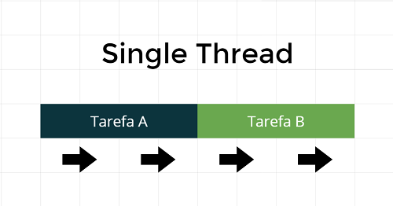
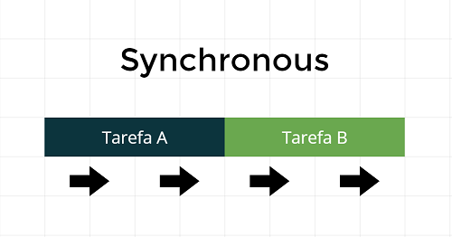
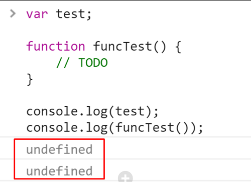
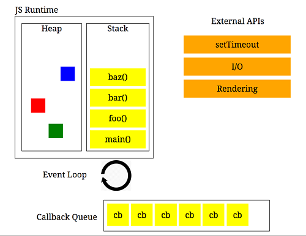

# Review of the basics of Javascript

* [Javascript definition](#Javascript-definition)
    * [Interpreted](#interpreted)
    * [Non Typed](#non-typed)
    * [Single Thread](#single-thread)
    * [Synchronous](#synchronous)
    * [Asynchronous](#asynchronous)
* [Types](#types)
    * [Undefined](#undefined)
    * [Number](#number)   
    * [String](#string)   
    * [Function](#function)   
    * [Object](#Object)   
* [Equality operators](#equality-operators)
* [Hoisting](#hoisting)
* [Asynchronous](#callback)
    * [Callback](#callback)
    * [Promises](#promises)
    * [Observables](#observable)
* [Callback Queue](#callback-queue)

## Javascript definition
- Javascript is an interpreted, non typed, single thread and syncronous language |o|.

## Interpreted
- Javascript is interpreted at runtime by the client browser.

## Non typed
- Javascript is a non typed language.
- It means that you don't have types in Javascript, you can change during runtime.

```js
var name = 'Walter White';

name = true; // You can change the type.
name = 20;   // You can change the type.
```

## Single thread
- Javascript is Single Thread.
- It means that Javascript can execute only one thing at a time.



## Synchronous
- Javascript is Synchronous***.
- It means that Javascript can execute only one thing at a time too.



## Asynchronous
- Javascript is NOT Asynchronous by default.
- It means that Javascript can execute only one thing at a time.
- You can simulate asynchronous using the broswer's API (setTimeOut, Ajax).


## Types
- At the same way that Javascript is not typed, it can understand some types. :)
- Javascript undestand at runtime the basic types.
- Javascript evaluates expressions from left to right. Different sequences can produce different results:

```js
var age = 20 + 2 + 'benetti';
// Result: 22benetti
```

```js
var age = 'benetti' + 20 + 2;
// Result: benetti202
```

## Undefined
- It's the default value for variables.
- In the case of a function is void, it will always return undefined.
- It is the cause of the commum error 'Undefined is not a function!'.



## Number
```js
var age = 26;
```

## String
```js
var name = 'Nie Wiem';
```

## Boolean
```js
var hasMoney = true;
```

## Function
- It's a way to execute an action.
- Functions are objects too. :)

```js
function bar() {
    console.log('I am an object!');
}

console.log(bar.name); // Result bar
```

## Objects
- A Javascript object is a mapping between keys and values.
- Keys are strings (or Symbols) and values can be anything.
- This makes objects a natural fit for hashmaps.

```js
var person = {
    name: 'Joao e Maria'
};

// To ways of access the properties
person.name;
person['name'];
```

- In Javascript objects are a reference type. Two distinct objects are never equal, even if they have the same properties. Only comparing the same object reference with itself yields true.

```js
// Two variables, two distinct objects with the same properties
var fruit = {name: 'apple'};
var fruitbear = {name: 'apple'};

fruit == fruitbear; // return false
fruit === fruitbear; // return false
```
```js
// Two variables, a single object
var fruit = {name: 'apple'};
var fruitbear = fruit;  // assign fruit object reference to fruitbear

// here fruit and fruitbear are pointing to same object
fruit == fruitbear; // return true
fruit === fruitbear; // return true
```

## Equality operators
- In Javascript there's two main ways of equality.
- For equality of value ==.
- For equality of value and type ===.

```js
1  == '1' // true
1 === '1' // false
```
```js
1    ==  1         // true
'1'  ==  1         // true
1    == '1'        // true
0    == false      // true
0    == null       // false
var object1 = {'value': 'key'}, object2 = {'value': 'key'}; 
object1 == object2 // false
0    == undefined  // false
null == undefined  // true
```

## Hoisting
- Some programmers say that hoisting is move the declarations for the top of your file, but it is not!
- Hoisting is the order that Javascript is interpreted.
- In the first moment javacript only declare variables in the memory, with the default value (undefined).
- The default value for variables is undefined.
- Functions are stored in the memory with it's entire code.
- Basically, Javascript only executes the first part of variables's declaration: var nameOfVariable =
- After the = signal, it's an expression and Javascript on only executes expression in runtime.
```js
console.log(hello);

var hello = 'hello hoisting';

console.log(hello);

// Result: undefined, because hello is not defined yet.
// Result: hello hoisting
```
```js
sayHello();
sayGoodBye();

// Functions are store in the memory if it's entire code.
function sayHello() {
    console.log('hello hoisting');
}

// The default value for variables is undefined. Undefined is not a function!
var sayGoodBye = function() {
    console.log('goodbye hoisting');
}

// Result: hello hoisting
// Result: sayGoodBye is not a function
```

## Callback
- It's a way to execute something in the future.
- It's a way to simulate asynchronous using the browser API.
- Imagine that you have too many callbacks, inside callbacks.
- Yes, we have callback hell problem.

```js
function greeting(name) {
  alert('Hello ' + name);
}

function processUserInput(callback) {
  var name = prompt('Please enter your name.');
  callback(name);
}

processUserInput(greeting);
//The above example is a synchronous callback, as it is executed immediately.
```

```js
function executeInTheFuture() {
    console.log('Iam in the future!');
}

setTimeout(executeInTheFuture(), 5000);
```
## Promises
- It's a way to execute Javascript asynchronous using the browser APIs.
- It solve the callback hell problem! :)
- There is two parameters, resolve and reject.
- Resolve is executed in case of success.
- Reject is executed in case of error. 

```js
new Promise(function(resolve, reject) { ... } );
```

```js
let myFirstPromise = new Promise(function(resolve, reject) { ... } );

myFirstPromise
    .then((data) => console.log('Then method, catches the resolve function'))
    .catch((error) => console.log('Catch method, catches the reject function'));
```

```js
let myFirstPromise = new Promise((resolve, reject) => {
  // We call resolve(...) when what we were doing asynchronously was successful, and reject(...) when it failed.
  // In this example, we use setTimeout(...) to simulate async code. 
  // In reality, you will probably be using something like XHR or an HTML5 API.
  setTimeout(function(){
    resolve("Success!"); // Yay! Everything went well!
  }, 250);
});

myFirstPromise.then((successMessage) => {
  // successMessage is whatever we passed in the resolve(...) function above.
  // It doesn't have to be a string, but if it is only a succeed message, it probably will be.
  console.log("Yay! " + successMessage);
});
```

## Callback queue

